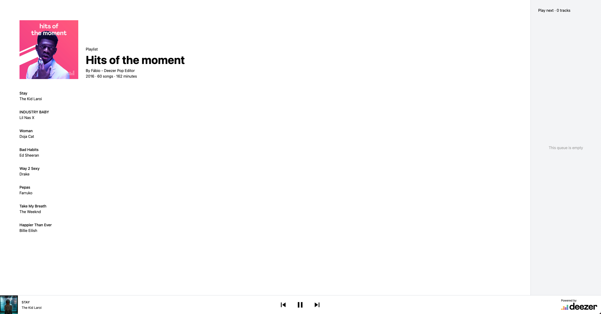

# HTML & CSS

The idea of this lab is to practice with HTML and CSS by implementing a responsive web page based on a provided mockup.


## Objectives

Complete the HTML and CSS files in the `public` directory to make it look as the provided mockups: [Mockup desktop](mockup
.png).




## Rules

- CSS Frameworks are not allowed for this exercise.
- Follow all the rules mentioned in the [Style guide](style-guide.png): Colors, Typography, dimensions, spacing, and responsive breakpoints.
- For any information/rules that are not specified in the style guide (i.e. the exact height of the header), you can decide what is the appropriate value.


## Submission and Corrections

- Please validate your HTML with https://validator.w3.org/ and your CSS with https://jigsaw.w3.org/css-validator/ before submitting your answer.
- To check whether your work is satisfying, your project will be automatically deployed to [Netlify](https://www.netlify.com/) and will check the results in Chrome (v85 or greater).
- We have set up some tests to check if your page is corresponding to the mockup.


## Local development setup
### Install dependencies
```sh
npm install
```

### Run
Although you can directly open the [index.html](public/index.html) file with your browser and start coding, we advise you to use a development server such as [live-server](https://www.npmjs.com/package/live-server), which is a little development server written in Node.js with live reload capability.

Run throw the scripts added in [the package.json](package.json):
```sh
npm run dev
```

Once started, the server will serve the files in the `public` directory and automatically reload the browser when you save any file.

### Run tests
We have made some test with the library [cypress](https://www.cypress.io/).

You can locally run them with (the server need to be up):
```sh
npm run cypress:open
```

To run them without opening the browser(the server need to be up):
```shell
npm run cypress:run
```

To run them without opening the browser and a specific test file (the server will be run by start-server-and-test):
```shell
npm run test-with-server -- "npm run cypress:run -- --spec ./cypress/integration/test-file.js"
```
> This is useful for the CI

## Resources
- The Fonts used in the mockup can be loaded from https://fonts.google.com
- CSS Reference https://developer.mozilla.org/en-US/docs/Web/CSS/Reference

___

Happy coding 🤓 !
