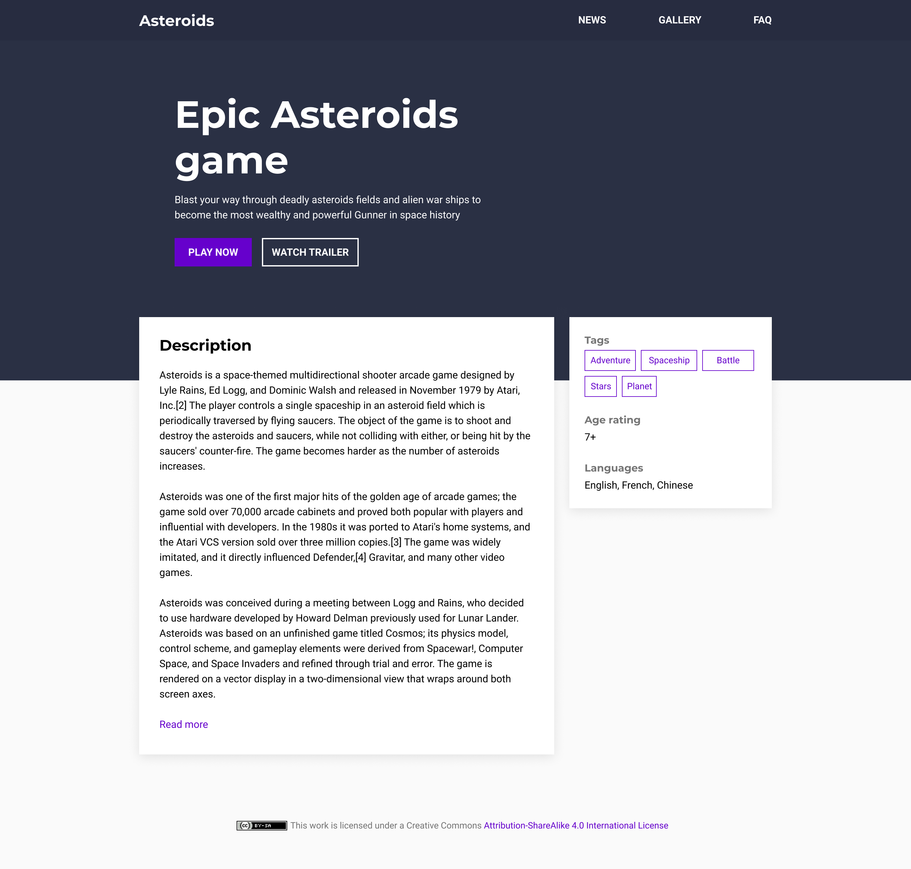

# HTML & CSS

The idea of this lab is to practice with HTML and CSS by implementing a responsive web page based on a provided mockup.


## Objectives

Complete the HTML and CSS files in the `public` directory to make it look as the provided mockups: [Mockup desktop](mockup-desktop.png) and [Mockup Mobile](mockup-mobile.png).




## Rules

- CSS Frameworks are not allowed for this exercise.
- Follow all the rules mentioned in the [Style guide](style-guide.png): Colors, Typography, dimensions, spacing, and responsive breakpoints.
- For any information/rules that are not specified in the style guide (i.e. the exact height of the header), you can decide what is the appropriate value.


## Submission and Corrections

- Please validate your HTML with https://validator.w3.org/ and your CSS with https://jigsaw.w3.org/css-validator/ before submitting your answer.
- To check whether your work is satisfying, your project will be automatically deployed to [Netlify](https://www.netlify.com/) and will check the results in Chrome (v85 or greater).


## Local development setup

Although you can directly open the [index.html](public/index.html) file with your browser and start coding, we advise you to use a development server such as [live-server](https://www.npmjs.com/package/live-server), which is a little development server written in Node.js with live reload capability.

Install globally with npm:
```sh
npm install -g live-server
```

Start the server by running the following command from your project directory:
```sh
live-server ./public
```

Once started, the server will serve the files in the `public` directory and automatically reload the browser when you save any file.


## Resources
- The Fonts used in the mockup can be loaded from https://fonts.google.com
- CSS Reference https://developer.mozilla.org/en-US/docs/Web/CSS/Reference
- Utility first approach https://tailwindcss.com/docs/utility-first
- Utility first libraries
  - https://tailwindcss.com/
  - https://tachyons.io/
- Sass https://sass-lang.com/
- CSS custom properties https://css-tricks.com/patterns-for-practical-css-custom-properties-use/

___

Happy coding 🤓 !
